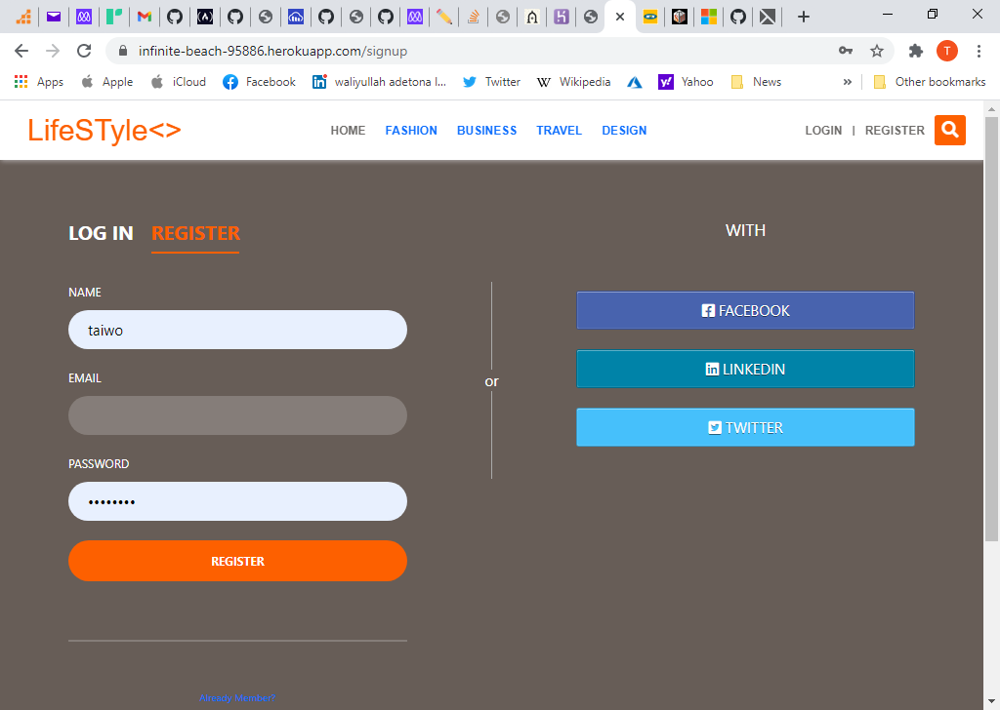
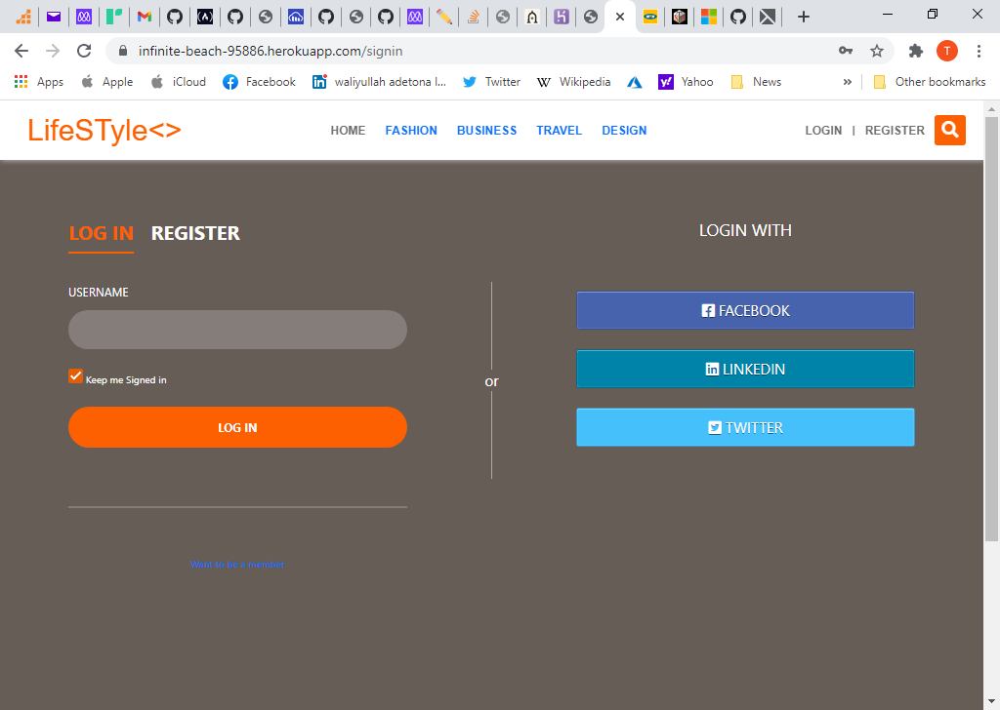
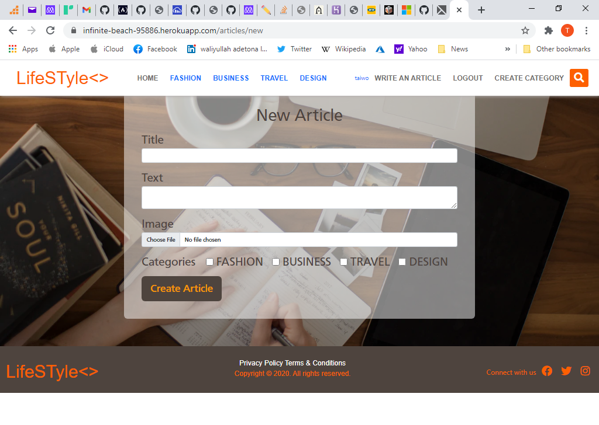
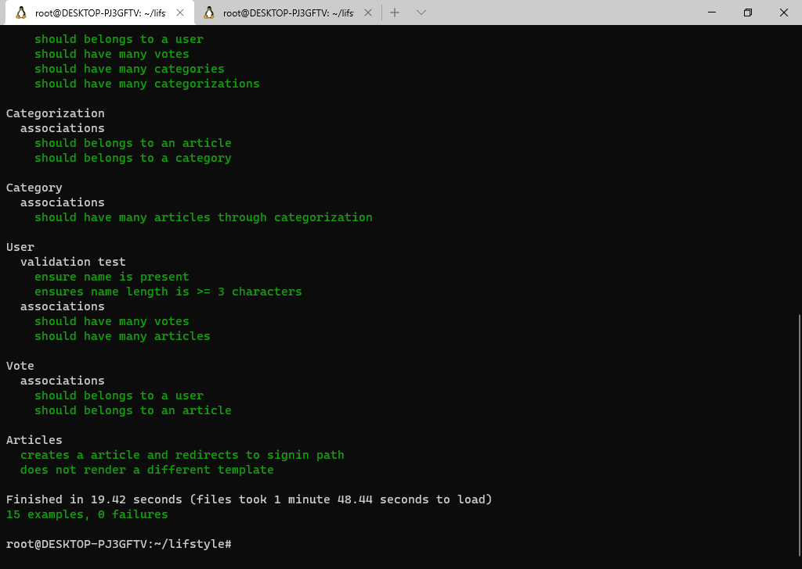

# LifeSTyle ROR Capstone project

> This project is for Ruby on Rails capstone which is, based on a lifestyle articles website. I have followed the given design, and I chose to develop this app for articles on women's lifestyles with 'Ruby on Rails". A new article can be created under one or multiple categories. You can upvote an article. The most voted article will be displayed on the home page's top section.

## Built With

- Ruby v2.7.2
- Ruby on Rails v6.1.0
- Rspec
- Capybara
- rubocop
- Bootstrap
- heroku

## Live Demo

[LifeSTyle](https://infinite-beach-95886.herokuapp.com/)

## Video Link

[Loom Presentation](https://www.loom.com/share/71953a998e114afb95ac9e3efd70aeba)


## Getting Started

To get a local copy up and running follow these simple example steps.İnitial

**Setup**

- Clone this repository with `https://github.com/taiwo2/ror-lifestyle-capstone.git` using your terminal or command line.<br>
- Change to the project directory by entering `cd ror-lifestyle-capstone` in the terminal<br>
- Next run `bundle install` to install the necessary dependencies<br>
- run rails `active_storage:install`
- run `rails db:create`
- Run `rails db:migrate` to setup your local database.<br>
- Run `rails db:seed` to get seeded data for project.<br>


### Usage

Start server with:

```
    rails server
```

Open `http://localhost:3000/` in your browser.

### Run tests

> for test formatting add below script in .rspec file

```
    rpsec --format documentation
```

> To run all the tests run below script in the terminal

`rspec`
#### Create User

Fill the sign up form to create a user



#### Login

Use only the username to login



#### Create a new article from the dropdown menu

Type your title and text, add an image, category



  ## Automated Test

* Run the command and see the output: 
```$ bundle exec rspec```


## Database Structure
 * Database schema used for this project reflects the following structure:
 
 

## Author

👤 **Taiwo Adetona**

- Github: [@taiwo2](https://github.com/taiwo2)

- LinkedIn: [Taiwo Adetona](https://www.linkedin.com/in/taiwo-adetona/)

- Twitter: [@TaiwoAdetona4](https://twitter.com/TaiwoAdetona4/)

## 🤝 Contributing

Contributions, issues and feature requests are welcome!

Feel free to check the [issues page](issues/).

## Show your support

Give a ⭐️ if you like this project!

## Acknowledgments

> [https://www.behance.net/gallery/14554909/liFEsTlye-Mobile-version](https://www.behance.net/gallery/14554909/liFEsTlye-Mobile-version)

> Design idea by [Nelson Sakwa on Behance](https://www.behance.net/sakwadesignstudio)


## 📝 License
[MIT](https://opensource.org/licenses/MIT) 
